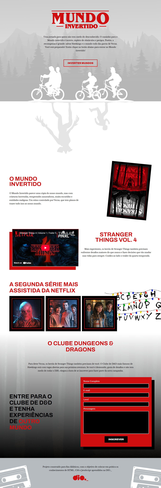
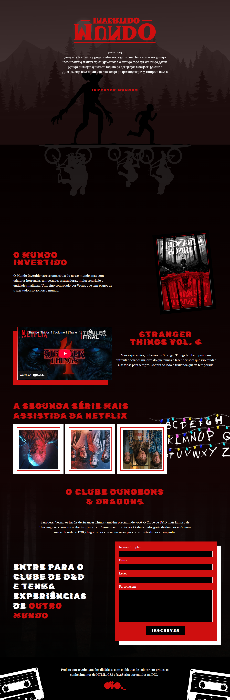

    

Projeto desenvolvido na Semana Front-End da DIO, no qual foi realizado um desafio para desenvolver uma página
utilizando conceitos de HTML, CSS e JavaScript, com o tema Upside Down (Mundo Invertido) da série Stranger Things

## Tecnologias Utilizadas 💻

- HTML
- CSS
- JavaScript

Coded by Bruno Mazeto
